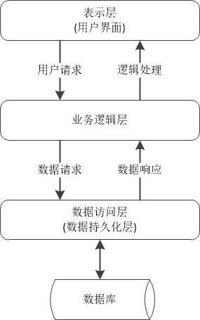

# 三层结构

在软件项目中，多层体系结构多用于CS系统结构，其基本思想是：物理和逻辑上清晰定义系统的分层；每个分层各司其职封装各自的业务逻辑；分层和分层之间有特定的通信和同步机制保证其构成一个有机整体。

多层体系结构提供了一种模型，开发人员可以通过该模型创建灵活且可重用的应用程序。通过将应用程序分成层，开发人员可以选择修改或添加特定层，而不是重新处理整个应用程序。多层体系结构在多数集成开发环境和高级软件开发包中均默认支持；多层体系结构最流行的是三层体系结构，三层体系结构通常由控制层，业务逻辑层和数据访问层组成。

## 通用分层

如上所述，多层体系结构最流行的是三层体系结构，在具有面向对象设计的信息系统的逻辑多层体系结构中，通用的分层是：

- 表示层。表示层又称为视图层或控制层。表示层从业务逻辑层和数据访问层抽取数据并计算展示出来。
- 业务逻辑层。业务逻辑层又称领域逻辑层。业务逻辑层提供面向领域的算法抽象。
- 数据访问层。数据访问层包含持久化层，日志记录，网络支持层等。数据访问层提供数据库存取操作。

三层体系结构流行于信息系统等大型软件中，由于嵌入式系统越来越复杂，嵌入式系统也开始引入三层体系结构。三层体系结构使用的领域逐渐扩大，基于多数中大型协议和规范均有分层体系结构的影子。

三层体系结构也有很多衍生体系结构，日趋精妙，诸如：数据持久化层。业务逻辑层不仅负责业务逻辑，而且直接访问数据库，提供对业务数据的增、删、改、查操作。为了把数据访问细节和业务逻辑分开，可以把数据访问作为单独的持久化层。持久化层封装了数据访问细节，为业务逻辑层提供了面向对象的API。完善的持久化层应该达到以下目标：(1)代码可重用性高，能够完成所有的数据库访问操作; (2)如果需要的话，能够支持多种数据库平台; (3)具有相对独立性，当持久化层的实现发生变化，不会影响上层的实现。在数据持久化层领域，出现了很多优秀的ORM软件。Hibernate是一种开源的ORM中间件，它是连接Java应用和关系数据库的管道。

## 三层体系结构的特征

三层体系结构具有以下特征：每个层由一组相关的类或组件（如EJB）构成，共同完成特定的功能；层与层之间存在自上而下的依赖关系，即上层组件会访问下层组建的API，而下层组件不应该依赖上层组件。每个层对上层公开API，但具体的实现细节对外透明。当某一层的实现发生变化，只要它的API不变，不会影响其它层的实现，即向上层视图公开接口，在本层视图封装实现细节。

三层体系结构具有伸缩性、维护性、扩展性和重用性。适当的分层配合集成开发环境分层架构的支持，三层体系结构将极大提高软件的性能。伸缩性保证系统支持系统服务能力的变化；维护性保证系统开发的风险性和性价比可控；扩展性保证系统对新业务扩容能力；重用性保证系统迁移、切换、升级的成本可控。

三层体系结构也包含若干缺点。软件分层越多，对软件设计人员的架构能力要求很高；对软件工程的规范程度要求很高，设计、开发、测试全流程均需要严格评估和实施；对团队协作要求很高，需要将军、谋士、队长和士兵的精密配合；对团队软件开发能力很高，数据库，数据结构，算法基础，设计模式，软件工程等知识需要综合使用。

## 三层体系最佳实践

多层体系结构最流行的是三层体系结构。三层体系结构包含数据访问层、业务逻辑层和表示层。

### 数据访问层的最佳实践

功能描述：处理与数据库之间的交互，不应对数据做任何业务上的加工。捕获数据库交互式出现的异常，抛出或记录下来。
功能说明：它的作用就是数据访问，如果你没有用其他的类似于ORM的框架，那么这里应该是SQL语句集中营(数据的增删改查)，数据具体的访问语句(SQL语句等)禁止出现在业务逻辑层和表示层。信息管理类应用中，Hibernate中间件承担类似工作。

### 业务逻辑层的最佳实践

功能描述：接受从表示层传过来的数据，做业务上的数据校验，并实现业务流程，最后，把加工后的数据传给数据访问层。
功能说明：业务逻辑层设计的关键就是尽量的实现松耦合,以松耦合的功能模块的接口形式发布。

### 表示层的最佳实践

功能描述：把松散的业务逻辑层内的各个细分功能在这里整合，而后作为一个子系统的统一接口发布出去。
功能说明：表示层是对业务逻辑层的进一步封装。把几个有联系的业务逻辑组合为一个子系统发布出去。