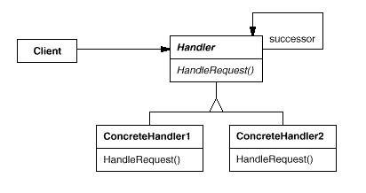

# Chain of Responsibility模式

责任链模式(Chain of Responsibility Pattern): 使多个对象都有机会处理请求，从而避免请求的发送者和接收者之间的耦合关系。将这些对象连成一条链，并沿着这条链传递该请求，直到有一个对象处理它为止。

Chain of Responsibility模式属于行为型模式。行为型模式涉及到算法和对象间职责的分配；行为型模式不仅描述对象或类的模式，还描述它们之间的通信模式。行为型模式刻划了在运行时难以跟踪的复杂的控制流；它们将你的注意力从控制流转移到对象间的联系方式上来。行为型模式主要包括：Chain of Responsibility模式、Command模式、Interpreter模式、Iterator模式、Mediator模式、Memento模式、Observer模式、State模式、Strategy模式、Template Method模式和Visitor模式。行为型模式在某种程度上具有相关性。

## 模式简介

GOF的《设计模式》指出Chain of Responsibility模式的意图是：  
使多个对象都有机会处理请求，从而避免请求的发送者和接收者之间的耦合关系。将这些对象连成一条链，并沿着这条链传递该请求，直到有一个对象处理它为止。

Chain of Responsibility模式适用于以下场景：

- 有多个的对象可以处理一个请求，哪个对象处理该请求运行时刻自动确定。
- 你想在不明确指定接收者的情况下，向多个对象中的一个提交一个请求。
- 可处理一个请求的对象集合应被动态指定。

## 模式图解

Chain of Responsibility模式的UML示例如下：

Chain of Responsibility模式的工作过程如下：

- Handler类定义一个处理请求的接口；
- ConcreteHandler类处理本质的请求，并将其他请求分发给后继者；
- Client类向链上的具体处理者(ConcreteHandler)对象提交请求。
- 当客户提交一个请求时，请求沿责任链传递到 ConcreteHandler 对象负责处理它。

Chain of Responsibility模式的有益效果如下：

- 降低耦合度：该模式使得一个对象无需知道是其他哪一个对象处理其请求。
- 增强了给对象指派职责(Responsibility)的灵活性：当在对象中分派职责时，在运行时动态指定实际处理请求的职责实体。
- 不确保请求一定被处理：没有明确的接收者时，该请求最终被丢弃。

责任链常与Composite模式一起使用，此时一个构件的父构件可作为它的后继。

## 模式实例

图形编辑器框架Unidraw定义了“命令” Command对象，它封装了发给Component和ComponentView对象的请求。一个构件或构件视图可解释一个命令以进行一个操作，这里“命令”就是请求。这对应于在实现一节中描述的 “对象作为请求” 的方法。构件和构件视图可以组织为层次式的结构。一个构件或构件视图可将命令解释转发给它的父构件，而父构件依次可将它转发给它的父构件，如此类推，就形成了一个责任链。

## 软件设计模式系列
 [软件设计模式专题-Github](https://github.com/media-tm/MTDesignPattern)
 [软件设计模式专题-CSDN](https://blog.csdn.net/shareviews/article/details/82630977)
