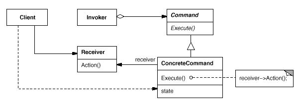

# Command模式

命令模式(Command Pattern): 将一个请求封装为一个对象，从而使你可用不同的请求对客户进行参数化；对请求排队或记录请求日志，以及支持可撤消的操作。

Command模式属于行为型模式。行为型模式涉及到算法和对象间职责的分配；行为型模式不仅描述对象或类的模式，还描述它们之间的通信模式。行为型模式刻划了在运行时难以跟踪的复杂的控制流；它们将你的注意力从控制流转移到对象间的联系方式上来。行为型模式主要包括：Chain of Responsibility模式、Command模式、Interpreter模式、Iterator模式、Mediator模式、Memento模式、Observer模式、State模式、Strategy模式、Template Method模式和Visitor模式。行为型模式在某种程度上具有相关性。

## 模式简介

GOF的《设计模式》指出Command模式的意图是：  
将一个请求封装为一个对象，从而使你可用不同的请求对客户进行参数化；对请求排队或记录请求日志，以及支持可撤消的操作。

有时必须向某对象提交请求，但并不知道关于被请求的操作或请求的接受者的任何信息。命令模式通过将请求本身变成一个对象来使工具箱对象可向未指定的应用对象提出请求。这个对象可被存储并像其他的对象一样被传递。这一模式的关键是一个抽象的Command类，它定义了一个执行操作的接口。其最简单的形式是一个抽象的Execute操作。具体的Command子类将接收者作为其一个实例变量，并实现Execute操作，指定接收者采取的动作。而接收者有执行该请求所需的具体信息。

Command模式适用于以下场景：

- 在不同的时刻指定、排列和执行请求。一个Command对象可以有一个与初始请求无关的生存期。如果一个请求的接收者可用一种与地址空间无关的方式表达，那么就可将负责该请求的命令对象传送给另一个不同的进程并在那儿实现该请求。
- 支持取消操作。Command接口支持Execute操作和Unexecute操作。
- 支持修改日志，这样当系统崩溃时，这些修改可以被重做一遍。在Command接口中添加装载操作和存储操作，记录所有的操作；从崩溃恢复时重新读入记录的命令并用Unexecute操作重新执行它们。
- 系统能够事务(Transaction)的高级原语操作。用Command模式对事务建模，接口一致的对所有事务进行操作。

## 模式图解

Command模式的UML示例如下：

Command模式的工作过程如下：

- Command类声明执行操作的接口。
- ConcreteCommand类将一个接收者对象绑定于一个动作。调用接收者相应的操作，以实现Execute和Unexecute操作。
- Client类创建一个具体命令对象并设定它的接收者。
- Invoker类要求该命令执行这个请求。
- Receiver类知道如何实施与执行一个请求相关的操作。任何类都可能作为一个接收者。
- Client对象创建一个oncreteCommand对象并指定它的Receiver对象。
- Invoker对象存储该ConcreteCommand对象。

Command模式的有益效果如下：

- Command模式能够将调用操作的对象与知道如何实现该操作的对象解耦。
- Command对象可以被操纵和扩展。
- Command模式能够将多个命令装配成一个复合命令。
- 容易扩展Command实体

Composite模式可被用来实现宏命令。Memento模式可用来保持某个状态，命令用这一状态来取消它的效果。

## 模式实例

[TODO]

## 系列文章

- [CSDN专栏: 设计模式(UML/23种模式)](https://blog.csdn.net/column/details/27399.html)
- [Github专栏: 设计模式(UML/23种模式)](https://github.com/media-tm/MTDesignPattern)

## 参考文献

- [GOF的设计模式：可复用面向对象软件的基础](http://item.jd.com/10057319.html)
- [设计模式之禅](http://item.jd.com/11414555.html)
- [图说设计模式](https://github.com/me115/design_patterns)