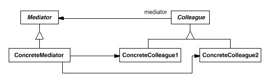

# Mediator模式

中介者模式(Mediator Pattern): 用一个中介对象来封装一系列的对象交互。中介者使各对象不需要显式地相互引用，从而使其耦合松散，而且可以独立地改变它们之间的交互。

Mediator模式属于行为型模式。行为型模式涉及到算法和对象间职责的分配；行为型模式不仅描述对象或类的模式，还描述它们之间的通信模式。行为型模式刻划了在运行时难以跟踪的复杂的控制流；它们将你的注意力从控制流转移到对象间的联系方式上来。行为型模式主要包括：Chain of Responsibility模式、Command模式、Interpreter模式、Iterator模式、Mediator模式、Memento模式、Observer模式、State模式、Strategy模式、Template Method模式和Visitor模式。行为型模式在某种程度上具有相关性。

## 模式简介

GOF的《设计模式》指出Mediator模式的意图是：  
用一个中介对象来封装一系列的对象交互。中介者使各对象不需要显式地相互引用，从而使其耦合松散，而且可以独立地改变它们之间的交互

面向对象设计鼓励将行为分布到各个对象中。这种分布可能会导致对象间有许多连接。在最坏的情况下,每一个对象都知道其他所有对象。虽然将一个系统分割成许多对象通常可以增强可复用性 , 但是对象间相互连接的激增又会降低其可复用性。大量的相互连接使得一个对象似乎不太可能在没有其他对象的支持下工作—系统表现为一个不可分割的整体。而且 ,对系统的行为进行任何较大的改动都十分困难，因为行为被分布在许多对象中。灾难来了，你可能不得不定义很多子类以定制系统的行为。

Mediator模式适用于以下场景：

- 一组对象以定义良好但是复杂的方式进行通信， 产生的相互依赖关系结构混乱且难以理解。
- 一个对象引用其他很多对象并且直接与这些对象通信, 导致难以复用该对象。
- 想定制一个分布在多个类中的行为，而又不想生成太多的子类。

## 模式图解

Mediator模式的UML示例如下：

Mediator模式的工作过程如下：

- Mediator中介者定义一个接口用于与各同事对象通信。
- ConcreteMediator具体中介者通过协调各同事对象实现协作行为。
- Colleague每一个同事类都知道它的中介者对象。同事之间不直接通信，通过中介者间接通信。
- Colleague向一个中介者对象发送和接收请求。中介者在各同事间适当地转发请求以实现协作

Mediator模式的有益效果如下：

- 有利于减少了子类生成：Mediator将原本分布于多个对象间的行为集中在一起。
- 有利于Colleague之间的解耦：Mediator有利于各Colleague间的松耦合。
- 有利于简化对象交互协议：用Mediator和各Colleague间的一对多的交互来代替多对多的交互。
- 有利于简化对象的协作：将中介作为一个独立的概念并将其封装在一个对象中，使你将注意力从对象各自本身的行为转移到它们之间的交互上来。
- 有利于控制集中化：中介者模式将交互的复杂性变为中介者的复杂性。

Facade模式与Mediator模式的不同之处在于它是对一个对象子系统进行抽象，从而提供了一个更为方便的接口。它的协议是单向的，即Facade对象对这个子系统类提出请求，但反之则不行。相反，Mediator提供了各Colleague对象不支持或不能支持的协作行为，而且协议是多向的。Colleague可使用Observer模式与Mediator通信。

## 模式实例

迭代器在面向对象系统中很普遍。大多数集合类库都以不同的形式提供了迭代器。

流行的集合类库Boost提供队列(Queue)的固定大小和动态大小的两种实现。队列的接口由抽象的Queue类定义。为了支持多态迭代，队列迭代器的实现基于抽象的Queue类接口。这样做的优点在于，不需要每个队列都实现一个Factory Method来提供合适的迭代器。
但是, 它要求抽象Queue类的接口的功能足够强大以有效地实现通用迭代器。
