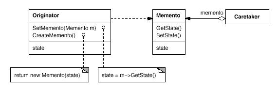

# Memento模式

备忘录模式(Memento Pattern): 在不破坏封装性的前提下，捕获一个对象的内部状态，并在该对象之外保存这个状态。这样以后就可将该对象恢复到原先保存的状态。

Memento模式属于行为型模式。行为型模式涉及到算法和对象间职责的分配；行为型模式不仅描述对象或类的模式，还描述它们之间的通信模式。行为型模式刻划了在运行时难以跟踪的复杂的控制流；它们将你的注意力从控制流转移到对象间的联系方式上来。行为型模式主要包括：Chain of Responsibility模式、Command模式、Interpreter模式、Iterator模式、Mediator模式、Memento模式、Observer模式、State模式、Strategy模式、Template Method模式和Visitor模式。行为型模式在某种程度上具有相关性。

## 模式简介

GOF的《设计模式》指出Memento模式的意图是：  
在不破坏封装性的前提下，捕获一个对象的内部状态，并在该对象之外保存这个状态。这样以后就可将该对象恢复到原先保存的状态。

有时有必要记录一个对象的内部状态。为了允许用户取消不确定的操作或从错误中恢复过来，需要实现检查点和取消机制 , 而要实现这些机制，你必须事先将状态信息保存在某处，这样才能将对象恢复到它们先前的状态。但是对象通常封装了其部分或所有的状态信息 , 使得其状态不能被其他对象访问，也就不可能在该对象之外保存其状态。而暴露其内部状态又将违反封装的原则，可能有损应用的可靠性和可扩展性。

Memento模式适用于以下场景：

- 必须保存一个对象在某一个时刻的 (部分)状态, 这样以后需要时它才能恢复到先前的状态。
- 如果一个用接口来让其它对象直接得到这些状态，将会暴露对象的实现细节并破坏对象的封装性。

## 模式图解

Memento模式的UML示例如下：

Memento模式的工作过程如下：

- Memtoto备忘录存储原发器对象的内部状态。Originator原发器根据需要决定备忘录存储原发器的哪些内部状态；禁止其他对象访问备忘录。
- Originator原发器创建一个备忘录, 用以记录当前时刻它的内部状态,并且可以使用备忘录恢复内部状态.。
- Caretaker管理器负责保存备忘录但是不能对内容进行操作或检查。
- Caretaker管理器向Originator原发器请求一个备忘录, 保留一段时间后, 将其送回给Originator原发器

Memento模式的有益效果如下：

- 有利于保持封装边界：使用备忘录可以避免暴露一些只应由原发器管理却又必须存储在原发器之外的信息。
- 有利于简化原发器： Originator负责保持客户请求过的内部状态版本，让客户管理它们请求的状态将会简化Originator, 并且使得客户工作结束时无需通知原发器。
- 管理和维护备忘录的成本较高：创建、恢复和删除备忘录的操作均有较大开销。

Command模式：命令可使用备忘录来为可撤消的操作维护状态。Iterator模式: 如前所述备忘录可用于迭代。

## 模式实例

[TODO]