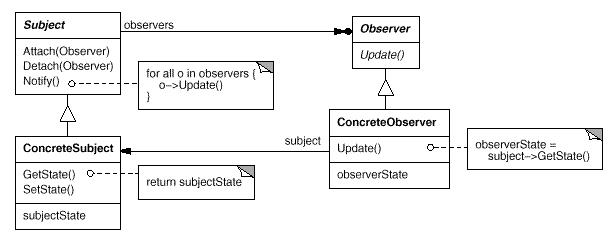

# Observer模式

观察者模式(Observer Pattern): 定义对象间的一种一对多的依赖关系, 当一个对象的状态发生改变时, 所有依赖于它的对象都得到通知并被自动更新。

Observer模式属于行为型模式。行为型模式涉及到算法和对象间职责的分配；行为型模式不仅描述对象或类的模式，还描述它们之间的通信模式。行为型模式刻划了在运行时难以跟踪的复杂的控制流；它们将你的注意力从控制流转移到对象间的联系方式上来。行为型模式主要包括：Chain of Responsibility模式、Command模式、Interpreter模式、Iterator模式、Mediator模式、Memento模式、Observer模式、State模式、Strategy模式、Template Method模式和Visitor模式。行为型模式在某种程度上具有相关性。

## 模式简介

GOF的《设计模式》指出Observer模式的意图是：  
定义对象间的一种一对多的依赖关系, 当一个对象的状态发生改变时, 所有依赖于它的对象都得到通知并被自动更新。

将一个系统分割成一系列相互协作的类有一个常见的副作用：需要维护相关对象间的一致性。我们不希望为了维持一致性而使各类紧密耦合，因为这样降低了它们的可重用性。

Observer模式适用于以下场景：

- 当一个抽象模型有两个方面, 其中一个方面依赖于另一方面。将这二者封装在独立的对象中以使它们可以各自独立地改变和复用。
- 当对一个对象的改变需要同时改变其它对象, 而不知道具体有多少对象有待改变。
- 当一个对象必须通知其它对象，而它又不能假定其它对象是谁。换言之, 你不希望这些对象是紧密耦合的。

## 模式图解

Observer模式的UML示例如下：

Observer模式的工作过程如下：

- Subject目标知道它的观察者。其支持若干个观察者观察同一个目标；提供注册和删除观察者对象的接口。
- Observer观察者为那些在目标发生改变时需获得通知的对象定义一个更新接口。
- ConcreteSubject具体目标将有关状态存入各ConcreteObserver对象, 并通知观察者其状态变化。
- ConcreteObserver具体观察者维护一个指向ConcreteSubject对象的引用，其通过Observer更新接口保持自身状态与目标状态一致。

Observer模式的有益效果如下：

- 有利于目标和观察者间的松耦合：目标对象可以有若干个观察者，目标对象不关心观察者的行为。
- 支持广播通信。目标对象发送的通知不需指定它的接收者，通知被自动广播给所有已向该目标对象登记的有关对象。
- 如果依赖准则的维护不当，很难捕捉这种错误更新。

Mediator模式: 通过封装复杂的更新语义, ChangeManager充当目标和观察者之间的中介者。 ChangeManager可使用Singleton模式来保证它是唯一的并且是可全局访问的。

## 模式实例

[TODO]