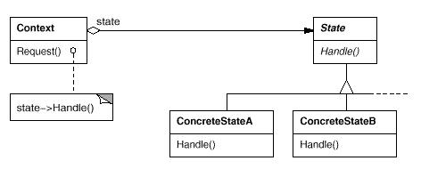

# State模式

状态模式(State Pattern): 允许一个对象在其内部状态改变时改变它的行为。对象看起来似乎修改了它的类。

State模式属于行为型模式。行为型模式涉及到算法和对象间职责的分配；行为型模式不仅描述对象或类的模式，还描述它们之间的通信模式。行为型模式刻划了在运行时难以跟踪的复杂的控制流；它们将你的注意力从控制流转移到对象间的联系方式上来。行为型模式主要包括：Chain of Responsibility模式、Command模式、Interpreter模式、Iterator模式、Mediator模式、Memento模式、Observer模式、State模式、Strategy模式、Template Method模式和Visitor模式。行为型模式在某种程度上具有相关性。

## 模式简介

GOF的《设计模式》指出State模式的意图是：  
允许一个对象在其内部状态改变时改变它的行为。对象看起来似乎修改了它的类。

考虑一个表示网络连接的类TCPConnection。TCPConnection对象的状态处于若干不同状态之一: 连接已建立(Established)、正在监听(Listening)、连接已关闭(Closed)。当一个TCPConnection对象收到其他对象的请求时 , 它根据自身的当前状态作出不同的反应。状态模式的关键思想是引入了一个称为TCPState的抽象类来表示网络的连接状态。TCPState类为各表示不同的操作状态的子类声明了一个公共接口。 TCPState的子类实现与特定状态相关的行为。

State模式适用于以下场景：

- 对象的行为取决于它的状态, 并且它必须在运行时刻根据状态改变它的行为。
- 对象包含大量条件分支语句，并通过枚举和分支语句处理不同状态的行为。
- State模式将每个状态封装在独立的类中。这一对象可以不依赖于其他对象而独立变化。

## 模式图解

State模式的UML示例如下：

State模式的工作过程如下：

- Context环境类(诸如: TCPConnection)定义客户感兴趣的接口。其维护ConcreteState的实例，表示当前状态。
- State状态类(诸如: TCPState)定义一个接口以封装与Context的一个特定状态相关的行为。
- ConcreteState具体状态子类(诸如:如TCPEstablished, TCPListen, TCPClosed), 子类实现一个与Context相关的行为。

State模式的有益效果如下：

- 它将与特定状态相关的行为局部化, 并且将不同状态的行为分割开来State模式将所有与一个特定的状态相关的行为都放入一个对象中。避免了大量的宏定义和分支操作。
- 它使得状态转换显式化。
- 在不同的Context对象之间可以共享State对象。

Flyweight模式解释了何时以及怎样共享状态对象。状态对象通常是定义为Singleton。

## 模式实例

Johnson和Zweig描述了State模式以及它在TCP连接协议上的应用。