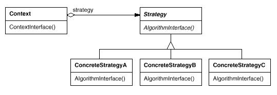

# Strategy模式

策略模式(Strategy Pattern): 定义一系列的算法,把它们一个个封装起来, 并且使它们可相互替换。本模式使得算法可独立于使用它的客户而变化。

Strategy模式属于行为型模式。行为型模式涉及到算法和对象间职责的分配；行为型模式不仅描述对象或类的模式，还描述它们之间的通信模式。行为型模式刻划了在运行时难以跟踪的复杂的控制流；它们将你的注意力从控制流转移到对象间的联系方式上来。行为型模式主要包括：Chain of Responsibility模式、Command模式、Interpreter模式、Iterator模式、Mediator模式、Memento模式、Observer模式、State模式、Strategy模式、Template Method模式和Visitor模式。行为型模式在某种程度上具有相关性。

## 模式简介

GOF的《设计模式》指出Strategy模式的意图是：  
定义一系列的算法,把它们一个个封装起来, 并且使它们可相互替换。本模式使得算法可独立于使用它的客户而变化。

解决一个具体的问题存在若干中解决方法，但是调用者硬编码方式调用这些算法，将失去很多灵活性。我们可以使用策略模式来避免这些问题，将我们使用这些算法的策略封装到策略模式中。

Strategy模式适用于以下场景：

- 许多相关的类仅仅是行为有异。“策略”提供了一种用多个行为中的一个行为来配置一个类的方法。
- 需要使用一个算法的不同变体。当这些变体实现为一个算法的类层次时，可以使用策略模式。
- 算法使用客户不应该知道的数据。可使用策略模式以避免暴露复杂的、与算法相关的数据结构。
- 一个类定义了多种行为, 并且这些行为在这个类的操作中以多个条件语句的形式出现。

## 模式图解

Strategy模式的UML示例如下：

Strategy模式的工作过程如下：

- Strategy策略定义所有支持的算法的公共接口。
- ConcreteStragy具体策略实施以Strategy接口实现某具体算法。
- Context上下文用一个ConcreteStragy对象来配置。并维护一个Strategy对象的引用。Context使用Strategy接口访问ConcreteStragy的算法。

Strategy模式的有益效果如下：

- 相关算法系列Strategy类层次为Context定义了一系列的可供重用的算法或行为。
- 容易扩展Strategy的子类以支持多种算法。
- 针对策略选择问题，提供了用条件语句外的另一种解决方案。

Flyweight：Strategy对象经常是很好的轻量级对象。

## 模式实例

著名的Boost库将Strategy用作模板参数。Boost集合类支持三种不同的存储分配策略：管理的（从一个存储池中分配），控制的(分配/去配有锁保护)，以及无管理的（正常的存储分配器）。在一个集合类实例化时，将这些Strategy作为模板参数传递给它。

Android框架中大量使用了Strategy模式，诸如：

- ${android_sdk_root}/external/chromium_org/net/http/http_basic_state.h
- ${android_sdk_root}/external/chromium_org/net/http/http_basic_state.cc
- ${android_sdk_root}/external/chromium_org/net/http/transport_security_state.h
- ${android_sdk_root}/external/chromium_org/net/http/transport_security_state.cc

## 系列文章

- [CSDN专栏: 设计模式(UML/23种模式)](https://blog.csdn.net/column/details/27399.html)
- [Github专栏: 设计模式(UML/23种模式)](https://github.com/media-tm/MTDesignPattern)

## 参考文献

- [GOF的设计模式：可复用面向对象软件的基础](http://item.jd.com/10057319.html)
- [设计模式之禅](http://item.jd.com/11414555.html)
- [图说设计模式](https://github.com/me115/design_patterns)
