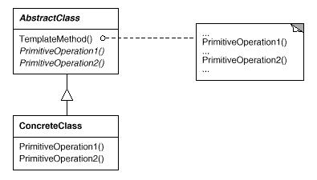

# Template Method模式

模板模式(Template Method Pattern): 定义一个操作中的算法的骨架，而将一些步骤延迟到子类中。Template Method使得子类可以不改变一个算法的结构即可重定义该算法的某些特定步骤。

Template Method模式属于行为型模式。行为型模式涉及到算法和对象间职责的分配；行为型模式不仅描述对象或类的模式，还描述它们之间的通信模式。行为型模式刻划了在运行时难以跟踪的复杂的控制流；它们将你的注意力从控制流转移到对象间的联系方式上来。行为型模式主要包括：Chain of Responsibility模式、Command模式、Interpreter模式、Iterator模式、Mediator模式、Memento模式、Observer模式、State模式、Template Method模式、Template Method模式和Visitor模式。行为型模式在某种程度上具有相关性。

## 模式简介

GOF的《设计模式》指出Template Method模式的意图是：  
定义一个操作中的算法的骨架，而将一些步骤延迟到子类中。Template Method使得子类可以不改变一个算法的结构即可重定义该算法的某些特定步骤。

Template Method模式适用于以下场景：

- 一次性实现一个算法的不变的部分，并将可变的行为留给子类来实现。
- 各子类中公共的行为应被提取出来并集中到一个公共父类中以避免代码重复。
- 控制子类扩展。模板方法只在特定点调用“hook”操作， 这样就只允许在这些点进行扩展。

## 模式图解

Template Method模式的UML示例如下：

Template Method模式的工作过程如下：

- AbstractClass抽象类定义抽象的原语操作(primitive operation)，具体的子类将重定义它们以实现一个算法的各步骤。抽象类还定义了模板方法, 定义一个算法的骨架。
- ConcreteClass具体类实现原语操作以完成算法中与特定子类相关的步骤。

Template Method模式的有益效果如下：

模板方法导致一种反向的控制结构，这种结构有时被称为“好莱坞法则”，即“别找我们，我们找你”。这指的是一个父类调用一个子类的操作，而不是相反。

Factory Method模式常被模板方法调用。模板方法使用继承来改变算法的一部分。Strategy模式使用委托来改变整个算法。

## 模式实例

模板方法非常基本，它们几乎可以在任何一个抽象类中找到。

Android框架中大量使用了Template Method模式，诸如：

- ${android_sdk_root}/external/clang/lib/Parse/ParseTemplate.cpp
- ${android_sdk_root}/external/clang/lib/AST/DeclTemplate.cpp
- ${android_sdk_root}/external/clang/lib/AST/TemplateName.cpp
- ${android_sdk_root}/external/clang/lib/AST/TemplateBase.cpp
- ${android_sdk_root}/external/clang/lib/Sema/SemaTemplateInstantiate.cpp
- ${android_sdk_root}/external/clang/lib/Sema/SemaTemplateVariadic.cpp
- ${android_sdk_root}/external/clang/lib/Sema/SemaTemplate.cpp
- ${android_sdk_root}/external/clang/lib/Sema/SemaTemplateInstantiateDecl.cpp
- ${android_sdk_root}/external/clang/lib/Sema/SemaTemplateDeduction.cpp

## 系列文章

- [CSDN专栏: 设计模式(UML/23种模式)](https://blog.csdn.net/column/details/27399.html)
- [Github专栏: 设计模式(UML/23种模式)](https://github.com/media-tm/MTDesignPattern)

## 参考文献

- [GOF的设计模式：可复用面向对象软件的基础](http://item.jd.com/10057319.html)
- [设计模式之禅](http://item.jd.com/11414555.html)
- [图说设计模式](https://github.com/me115/design_patterns)