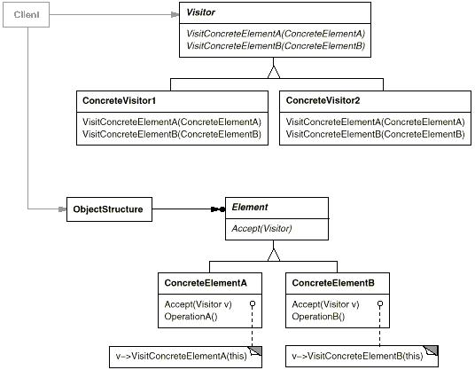

# Visitor模式

访问者模式(Visitor Pattern): 表示一个作用于某对象结构中的各元素的操作，它使我们可以在不改变各元素的类的前提下定义作用于这些元素的新操作。

Visitor模式属于行为型模式。行为型模式涉及到算法和对象间职责的分配；行为型模式不仅描述对象或类的模式，还描述它们之间的通信模式。行为型模式刻划了在运行时难以跟踪的复杂的控制流；它们将你的注意力从控制流转移到对象间的联系方式上来。行为型模式主要包括：Chain of Responsibility模式、Command模式、Interpreter模式、Iterator模式、Mediator模式、Memento模式、Observer模式、State模式、Visitor模式、Template Method模式和Visitor模式。行为型模式在某种程度上具有相关性。

## 模式简介

GOF的《设计模式》指出Visitor模式的意图是：  
表示一个作用于某对象结构中的各元素的操作，它使我们可以在不改变各元素的类的前提下定义作用于这些元素的新操作。

访问者模式的目的是封装一些施加于某种数据结构元素之上的操作，一旦这些操作需要修改的话，接受这个操作的数据结构可以保持不变。为不同类型的元素提供多种访问操作方式，且可以在不修改原有系统的情况下增加新的操作方式，这就是访问者模式的模式动机。

Visitor模式适用于以下场景：

- 一个对象结构包含很多类对象，它们有不同的接口，而你想对这些对象实施一些依赖于其具体类的操作。
- 需要对一个对象结构中的对象进行很多不同的并且不相关的操作，而你想避免让这些操作“污染”这些对象的类。

## 模式图解

Visitor模式的UML示例如下：

Visitor模式的工作过程如下：

- Visitor访问者为该对象结构中ConcreteElement的每一个类声明一个Visit操作。
- ConcreteVisitor具体访问者实现每个由Visitor声明的操作。每个操作实现本算法的一部分，而该算法片断乃是对应于结构中对象的类。ConcreteVisitor为该算法提供了上下文并存储它的局部状态。
- Element元素定义抽象的Accept操作接口，该操作以一个访问者为参数。
- ConcreteElement具体元素实现Accept操作，该操作以一个访问者为参数。
- ObjectStructure对象结构:可以枚举它的元素;可以提供一个高层的接口以允许该访问者访问它的元素。

Visitor模式的有益效果如下：

- 访问者模式有利于新增新的访问操作。
- 访问者模式有利于用户在不修改现有类的层次结构下，定义该类层次结构的操作。
- 访问者模式有利于分离无关的操作: 相关的行为集中在一个访问者中;无关行为集中在的访问者子类中。

访问者模式可以用于对一个由Composite模式定义的对象结构进行操作。访问者模式可以用于Interpreter模式。

## 模式实例

Android框架中大量使用了Visitor模式，诸如：

- ${android_sdk_root}/external/clang/include/clang/AST/TypeLocVisitor.h
- ${android_sdk_root}/external/clang/include/clang/AST/RecursiveASTVisitor.h
- ${android_sdk_root}/external/clang/include/clang/AST/CommentVisitor.h
- ${android_sdk_root}/external/clang/include/clang/AST/DataRecursiveASTVisitor.h
- ${android_sdk_root}/external/clang/include/clang/AST/DeclVisitor.h
- ${android_sdk_root}/external/clang/include/clang/AST/StmtVisitor.h
- ${android_sdk_root}/external/clang/include/clang/AST/TypeVisitor.h
- ${android_sdk_root}/external/clang/include/clang/AST/EvaluatedExprVisitor.h