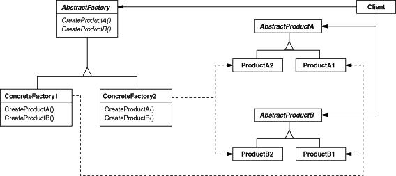

# AbstactFactory模式

抽象工厂模式为创建一组相关或相互依赖的对象提供一个接口，而且无需指定他们的具体类。抽象工厂模式属于创建型模式，创建型模式包括FactoryMethod模式，AbstactFactory模式，Singleton模式，ProtoType模式和Builder模式。

## 模式简介

抽象工厂模式是工厂方法模式的升级版本，他用来创建一组相关或者相互依赖的对象。他与工厂方法模式的区别就在于，工厂方法模式针对的是一个产品等级结构；而抽象工厂模式则是针对的多个产品等级结构。在编程中，通常一个产品结构，表现为一个接口或者抽象类，也就是说，工厂方法模式提供的所有产品都是衍生自同一个接口或抽象类，而抽象工厂模式所提供的产品则是衍生自不同的接口或抽象类。

GOF的《设计模式》指出抽象工厂模式的意图是：  
提供一个创建一系列相关或相互依赖对象的接口，而无需指定它们具体的类。

工厂模式主要是为创建对象提供了接口。工厂模式按照抽象层次可分为以下几类：简单工厂模式(Simple Factory)、工厂方法模式(Factory Method)和抽象工厂模式(Abstract Factory)。

Abstract Factory模式适用于以下场景：

- 一个系统要独立于它的产品的创建、组合和表示时。
- 一个系统要由多个产品系列中的一个来配置时。
- 当你要强调一系列相关的产品对象的设计以便进行联合使用时。
- 当你提供一个产品类库，而只想显示它们的接口而不是实现时。

## 模式图解

在抽象工厂模式中，有一个产品族的概念：所谓的产品族，是指位于不同产品等级结构中功能相关联的产品组成的家族。抽象工厂模式所提供的一系列产品就组成一个产品族；而工厂方法提供的一系列产品称为一个等级结构。我们依然拿生产汽车的例子来说明他们之间的区别。工厂方法模式的UML示例如下：

工厂方法模式的工作过程如下：

- AbstractFactory类声明一个创建抽象产品对象的操作接口；
- ConcreteFactory类实现创建具体产品对象的操作;
- AbstractProduct类声明了抽象的对象声明，即接口声明；
- ConcreteProduct类定义了具体工厂创建的产品对象，并实现了AbstractProduct接口；
- Client类使用抽象接口实现功能(AbstractFactory/AbstractProduct)

工厂方法模式的有益效果如下：

- 系统依赖于抽象的类，具体的类之间松耦合。
- 系统非常容易替换掉产品系列和工厂类型，更加配置替换工厂和产品类型也是可行的；
- 系统一致性获得增强，系统包含多种类型对象时，系统单次只能使用一种对象；
- 难以支持新种类的产品, 并且难以扩展抽象工厂以生产新种类的产品。

## 模式实例

Android中间件中工厂方法模式应用广泛，例如：

- ${android_sdk_root}/frameworks/av/media/libeffects/factory/EffectsFactory.c
- ${android_sdk_root}/frameworks/av/media/