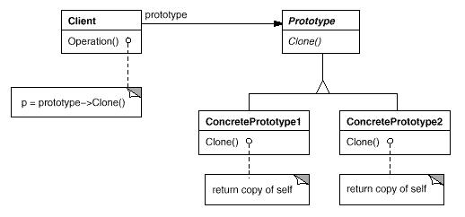

# Prototype模式

Prototype模式用原型实例指定创建对象的种类，并且通过拷贝这些原型创建新的对象。Prototype模式属于创建型模式，创建型模式包括FactoryMethod模式，AbstactFactory模式，Singleton模式，ProtoType模式和Builder模式。

## 模式简介

Prototype模式提供了一个通过已存在对象进行新对象创建的接口（Clone）， Clone()实现和具体的语言相关，在C++中通过拷贝构造函数实现。Prototype模式和Builder模式、AbstractFactory模式都是通过一个类（对象实例）来专门负责对象的创建工作（工厂对象），它们之间的区别是：Builder模式重在复杂对象的一步步创建（并不直接返回对象），AbstractFactory模式重在产生多个相互依赖类的对象，而Prototype模式重在从自身复制自己创建新类。

GOF的《设计模式》指出原型模式的意图是：  
用原型实例指定创建对象的种类，并且通过拷贝这些原型创建新的对象。

Prototype模式适用于以下场景：

- 当要实例化的类是在运行时刻指定时，例如，通过动态装载；
- 为了避免创建一个与产品类层次平行的工厂类层次时；
- 当一个类的实例只能有几个不同状态组合中的一种时。建立相应数目的原型并克隆它们可能比每次用合适的状态手工实例化该类更方便一些。

## 模式图解

原型模式用原型实例指定创建对象的种类，并且通过拷贝这些原型创建新的对象。原型模式的UML示例如下：

原型模式的工作过程如下：

- Prototype类声明克隆自身的接口；
- ConcretePrototype类实现了克隆自身的接口；
- Client类让一个原型克隆自身从而创建一个新的对象；

原型模式的有益效果如下：

- 运行时刻增加和删除产品Prototype允许只通过客户注册原型实例就可以将一个新的具体产品类并入系统；
- 改变值以指定新对象 高度动态的系统允许你通过对象复合定义新的行为；
- 改变结构以指定新对象 许多应用由部件和子部件来创建对象；
- 减少子类的构造 Factory Method；
- 用类动态配置应用，一些运行时刻环境允许你动态将类装载到应用中；

## 模式实例
[Android中的设计模式之原型模式](https://yq.aliyun.com/articles/628892)