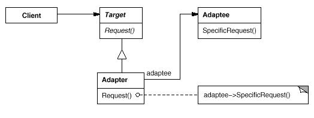

# Adapter模式

Adapter模式将一个类的接口转换成客户希望的另外一个接口。 Adapter模式使得原本由于接口不兼容而不能一起工作的那些类可以一起工作。

Adapter模式属于结构型模式,又称为包装器(Wrapper)模式。结构型模式涉及到如何组合类和对象以获得更大的结构；结构型类模式采用继承机制来组合接口或实现。结构型模式主要包括：Adapter模式、Bridge模式、Composite模式、Decorator模式、Facade模式、Flyweight模式和Proxy模式。结构型类模式在某种程度上具有相关性。

## 模式简介

GOF的《设计模式》指出Adapter模式的意图是：  
将一个类的接口转换成客户希望的另外一个接口。 Adapter模式使得原本由于接口不兼容而不能一起工作的那些类可以一起工作。

软件工程中，由于各种需求和领域的差异，往往存在现存的工具箱类的接口和目标的应用领域的接口不匹配。比如Android系统的标准的硬件接口是MediaCodec，但是目标应用是IPTV接口，这是仅仅需要将MediaCodec接口适配IPTV接口即可。

Adapter模式适用于以下场景：

- 你想使用一个已经存在的类，而它的接口不符合你的需求。
- 你想创建一个可以复用的类，该类可以与其他不相关的类或不可预见的类（即那些接口可能不一定兼容的类）协同工作。
- (仅适用于对象Adapter)你想使用一些已经存在的子类，但是不可能对每一个都进行子类化以匹配它们的接口。对象适配器可以适配它的父类接口。

## 模式图解

Adapter模式的UML示例如下：

Adapter模式的工作过程如下：

- Target类定义Client使用的与特定领域相关的接口。
- Client类与符合Target接口的对象协同。
- Adaptee类定义一个已经存在的接口，这个接口需要适配。
- Adapter类Adaptee的接口与Target接口进行适配。
- Client在Adapter实例上调用一些操作；接着Adapter调用Adaptee的操作实现这个请求。

Adapter模式的有益效果如下：

- 用一个具体的Adapter类对Adaptee和Target进行匹配。
- Adapter可以重定义Adaptee的部分行为，因为Adapter是Adaptee的一个子类。
- 仅仅引入了一个对象，并不需要额外的指针以间接得到 Adaptee。
- 允许一个Adapter与多个Adaptee(Adaptee以及其子类)同时工作。

Bridge模式的结构与对象适配器类似，但是Bridge模式的出发点不同： Bridge模式目的是将接口部分和实现部分分离，从而对它们可以较为容易也相对独立的加以改变。而Adapter模式其目标仅仅是改变一个已有对象的接口。

## 模式实例

Android框架中大量使用了Adapter模式

- ${android_sdk_root}/frameworks/av/include/media/stagefright/MediaAdapter.h
- ${android_sdk_root}/frameworks/av/include/media/
- ${android_sdk_root}/frameworks/base/core/java/android/widget/Adapter.java
- ${android_sdk_root}/frameworks/base/core/java/android/widget/BaseAdapter.java
- ${android_sdk_root}/frameworks/base/core/java/android/widget/ArrayAdapter.java
- ${android_sdk_root}/frameworks/base/core/java/android/widget/ListAdapter.java

## 系列文章

- [CSDN专栏: 设计模式(UML/23种模式)](https://blog.csdn.net/column/details/27399.html)
- [Github专栏: 设计模式(UML/23种模式)](https://github.com/media-tm/MTDesignPattern)

## 参考文献

- [GOF的设计模式：可复用面向对象软件的基础](http://item.jd.com/10057319.html)
- [设计模式之禅](http://item.jd.com/11414555.html)
- [图说设计模式](https://github.com/me115/design_patterns)