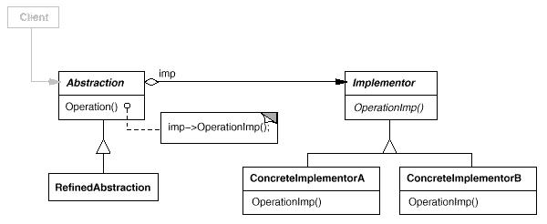

# Bridge模式

Bridge模式将抽象部分与它的实现部分分离，使它们都可以独立地变化。

Bridge模式属于结构型模式。结构型模式涉及到如何组合类和对象以获得更大的结构；结构型类模式采用继承机制来组合接口或实现。结构型模式主要包括：Adapter模式、Bridge模式、Composite模式、Decorator模式、Facade模式、Flyweight模式和Proxy模式。结构型类模式在某种程度上具有相关性。

## 模式简介

GOF的《设计模式》指出Bridge模式的意图是：  
Bridge模式将抽象部分与它的实现部分分离，使它们都可以独立地变化。

当一个抽象可能有多个实现时，通常用继承来协调它们。抽象类定义对该抽象的接口，而具体的子类则用不同方式加以实现。但是此方法有时不够灵活。继承机制将抽象部分与它的实现部分固定在一起，使得难以对抽象部分和实现部分独立地进行修改、扩充和重用。

Bridge模式适用于以下场景：

- 在抽象类和实现类之间不限定绑定关系，由调用模块决定确定的绑定关系；
- 抽象类和实现类均可通过子类加以扩展，Bridge模式可以对抽象接口和实现部分进行组合，并分别对它们进行扩充；
- 对一个抽象的实现部分的修改应对客户不产生影响，即客户的代码不必重新编译；
- 你想对客户完全隐藏抽象的实现部分。在 C++中，类的表示在类接口中是可见的；
- 你想在多个对象间共享实现（可能使用引用计数），并且对客户隐藏该细节；

## 模式图解

Bridge模式的UML示例如下：

Bridge模式的工作过程如下：

- Abstraction类定义抽象类的接口并维护一个指向Implementor类型对象的指针。
- RefinedAbstraction类扩充由Abstraction定义的接口。
- Implementor类定义实现类的接口，该接口可以不与Abstraction类的接口完全一致。Implementor提供基本操作，而Abstraction提供更高层次的操作。
- ConcreteImplementor类实现Implementor接口并定义它的具体实现。
- Abstraction将Clinet的请求转发给Implementor对象。

Bridge模式的有益效果如下：

- 支持接口定义和接口实现分离；并且接口实现动态绑定接口上(可配置可切换)。
- 支持单独对Abstraction和Implementor层次结构进行扩展。
- 实现细节对客户透明 你可以对客户隐藏实现细节，诸如共享Implementor对象以及相应的引用计数机制。

Abstract Factory 模式可以用来创建和配置一个特定的Bridge模式。Adapter模式用来帮助无关的类协同工作，它通常在系统设计完成后才会被使用。然而，Bridge模式则是在系统开始时就被使用，它使得抽象接口和实现部分可以独立进行改变。

## 模式实例

Coplien的String类[COP92],这个类中中多个对象可以共享同一个字符串表示(StringRep)。

- ${android_sdk_root}/frameworks/base/core/java/android/os/FileBridge.java