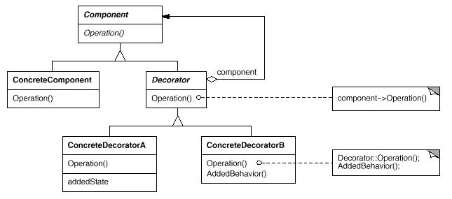

# 装饰器模式(Decorator Pattern)

装饰器模式(Decorator Pattern)Decorator模式能动态地给一个对象添加一些额外的职责。就增加功能来说, Decorator模式相比生成子类更为灵活。

装饰器模式(Decorator Pattern)属于结构型模式,又称为包装器(Wrapper)模式。结构型模式涉及到如何组合类和对象以获得更大的结构；结构型类模式采用继承机制来组合接口或实现。结构型模式主要包括：Adapter模式、Bridge模式、Composite模式、Decorator模式、Facade模式、Flyweight模式和Proxy模式。结构型类模式在某种程度上具有相关性。

## 模式简介

GOF的《设计模式》指出Decorator模式的意图是：  
动态地给一个对象添加一些额外的职责。就增加功能来说, Decorator模式相比生成子类更为灵活。

假如我们希望给某个对象而不是整个类添加一些附加的行为或功能。精巧的方式是将组件嵌入另一个对象中，由这个对象附加的行为或功能，我们称这个嵌入的对象为装饰。这个装饰与它所装饰的组件接口一致，因此它对使用该组件的客户透明。它将客户请求转发给该组件，并且可能在转发前后执行一些额外的动作。透明性使得你可以递归的嵌套多个装饰，从而可以添加任意多的功能。

Decorator模式适用于以下场景：

- 在不影响其他对象的情况下，以动态、透明的方式给单个对象添加职责。
- 处理那些可以撤消的职责。
- 当不能采用生成子类的方法进行扩充时。一种情况是，可能有大量独立的扩展，为支持每一种组合将产生大量的子类，使得子类数目呈爆炸性增长。另一种情况可能是因为类定义被隐藏，或类定义不能用于生成子类。

## 模式图解

Decorator模式的UML示例如下：

Decorator模式的工作过程如下：

- Component类定义一个对象接口，可以给这些对象动态地添加职责。
- ConcreteComponent类定义一个对象，可以给这个对象添加一些职责。
- Decorator类维持一个指向Component对象的指针，并定义与Component接口一致的接口。
- ConcreteDecorator类除了调用Component对象的职责，再附加一些额外的职责。
- Decorator类将请求转发给它的Component对象，并有可能在转发请求前后执行一些附加的动作。

Decorator模式的有益效果如下：

- 比静态继承更灵活，与对象的静态继承相比，Decorator模式提供了更加灵活的向对象添加职责的方式。
- 避免在层次结构高层的类有太多的特征 Decorator模式提供了一种“即用即付”的方法来添加职责。
- Decorator与它的Component不一样, Decorator是一个透明的包装。

Decorator模式的目标在于仅改变对象的职责而不改变它的接口；而Adapter模式的目标在于将给对象一个全新的接口；而Composite模式的目标在于对象聚集。

## 模式实例

Streams是大多数I/O设备的基础抽象结构，它提供了将对象转换成为字节或字符流的操作接口，使我们可以将一个对象转变成一个文件或内存中的字符串，可以在以后恢复使用。一个简单直接的方法是定义一个抽象的Stream类，它有多个子类 MemoryStream、FileStream和BufferedStream。假如我们增加附件的功能：进行不用的压缩方法，进行不同的加解密方法和不同的字符集转换。Decorator模式可能轻松将这些附加的功能集成起来。

Android框架中大量使用了Decorator模式，诸如：

- ${android_sdk_root/frameworks/support/v7/recyclerview/src/android/support/v7/widget/DividerItemDecoration.java