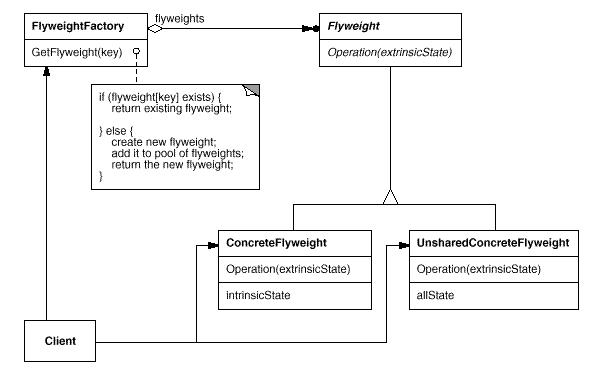

# 享元模式(Flyweight Pattern)

享元模式(Flyweight Pattern)运用共享技术有效地支持大量细粒度的对象。Flyweight模式即享元模式。

享元模式(Flyweight Pattern)属于结构型模式。结构型模式涉及到如何组合类和对象以获得更大的结构；结构型类模式采用继承机制来组合接口或实现。结构型模式主要包括：Adapter模式、Bridge模式、Composite模式、Decorator模式、Facade模式、Flyweight模式和Proxy模式。结构型类模式在某种程度上具有相关性。

## 模式简介

GOF的《设计模式》指出Flyweight模式的意图是：  
Flyweight模式运用共享技术有效地支持大量细粒度的对象。

FlyWeight是一个共享对象，它可以同时在多个场景中使用，并且在每个场景中FlyWeight都可以作为一个独立的对象。FlyWeight不能对它所运行的场景做出任何假设，这里的关键概念是内部状态和外部状态之间的区别。内部状态存储于FlyWeight中，它包含了独立于FlyWeight场景的信息，这些信息使得FlyWeight可以被共享。而外部状态取决于FlyWeight场景，并根据场景而变化，因此不可共享。用户对象负责在必要的时候将外部状态传递给FlyWeight。Flyweight模式对那些通常因为数量太大而难以用对象来表示的概念或实体进行建模。

Flyweight模式适用于以下场景：

- 一个应用程序使用了大量的对象。
- 完全由于使用大量的对象，造成很大的存储开销。
- 对象的大多数状态都可变为外部状态。
- 如果删除对象的外部状态，那么可以用相对较少的共享对象取代很多组对象。
- 应用程序不依赖于对象标识。由于FlyWeight对象可以被共享，对于概念上明显有别的对象。

## 模式图解

Flyweight模式的UML示例如下：

Flyweight模式的工作过程如下：

- Flyweight类描述一个接口，通过这个接口FlyWeight可以接受并作用于外部状态。
- ConcreteFlyweight类实现Flyweight接口，并为内部状态增加存储空间。ConcreteFlyweight对象必须是可共享的,其存储的状态必须是内部的。
- Flyweight接口并不强制共享，支持UnsharedConcreteFlyweight类。
- 在Flyweight对象结构的某些层次，UnsharedConcreteFlyweight对象通常将ConcreteFlyweight对象作为子节点。
- FlyweightFactory创建并管理Flyweight对象。
- 确保合理地共享Flyweight。
- Client类维持一个对Flyweight的引用,并计算或存储若干Flyweight的外部状态。
- Flyweight包含若干内部和外部状态。内部状态由ConcreteFlyweight对象存储；而外部状态由Client对象存储或。当用户操作Flyweight对象时，才将状态传递给它。
- 用户(Client类)间接从ConcreteFlyweightt对象获取ConcreteFlyweight对象，禁止直接创建FlyweightFactory。

Flyweight模式的有益效果如下：

使用Flyweight模式时，传输、查找和计算外部状态都会产生运行时的开销，尤其当Flyweight原先被存储为内部状态时。然而，空间上的节省抵消了这些开销。共享的Flyweight越多，空间节省也就越大。共享的Flyweight越多，存储节约也就越多。节约量随着共享状态的增多而增大。当对象使用大量的内部及外部状态，并且外部状态是计算出来的而非存储的时候，节约量将达到最大。所以，可以用两种方法来节约存储：用共享减少内部状态的消耗，用计算时间换取对外部状态的存储。

Flyweight模式经常和Composite模式结合起来，用共享叶结点的有向无环图实现一个逻辑上的层次结构。共享的结果是，Flyweight的叶节点不能存储指向父节点的指针。而父节点的指针将传给Flyweight作为它的外部状态的一部分。这对于该层次结构中对象之间相互通讯的方式将产生很大的影响。最佳实践是用Flyweight实现State和Strategy对象。

## 模式实例

Android框架中大量使用了Flyweight模式，诸如：

- ${android_sdk_root/external/libphonenumber/internal/prefixmapper/src/com/google/i18n/phonenumbers/prefixmapper/FlyweightMapStorage.java