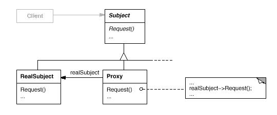

# 代理模式(Proxy Pattern)

代理模式(Proxy Pattern)为访问对象提供一个代理对象来实现对被访问者的访问，其实就是在访问对象与被访问对象之间添加一个中介，用来隔离访问者与被访问者的具体实现细节。

代理模式(Proxy Pattern)属于结构型模式。结构型模式涉及到如何组合类和对象以获得更大的结构；结构型类模式采用继承机制来组合接口或实现。结构型模式主要包括：Adapter模式、Bridge模式、Composite模式、Decorator模式、Facade模式、Flyweight模式和Proxy模式。结构型类模式在某种程度上具有相关性。

## 模式简介

GOF的《设计模式》指出Proxy模式的意图是：  
为访问对象提供一个代理对象来实现对被访问者的间接访问。

对一个对象进行访问控制的一个原因是为了只有在我们确实需要这个对象时才对它进行创建和初始化。在图像处理应用中，我们操作的目标是图像对象，该问题的解决方式是提供一个虚拟的图像图像，即图像Proxy，替代那个真正的图像。 Prox可以代替一个图像对象，并且在需要时负责实例化这个图像对象。

Proxy模式适用于以下场景：

- 远程代理(Remote Proxy)为一个对象在不同的地址空间提供局部代表。
- 虚代理(Virtual Proxy)根据需要创建开销很大的对象，诸如ImageProxy。
- 保护代理(Protection Proxy)控制对原始对象的访问。保护代理用于对象应该有不同的访问权限的时候。
- 智能指针(Smart Reference)取代了简单的指针，它在访问对象时执行一些附加操作。

## 模式图解

Proxy模式的UML示例如下：

Proxy模式的工作过程如下：

- 抽象对象(Subject)：声明了目标对象和代理对象的共同接口；
- 目标对象(RealSubsuject)：被代理或者被访问的对象；
- 代理对象(Proxy)：代理对象内部持有目标对象的引用，代理对象与目标对象实现相同的接口，Client 访问代理对象相当于间接访问目标对象。

Proxy模式的有益效果如下：

- 降低访问者与被访问者之间的耦合度
- 可以控制访问者对被访问者的访问权限
- 虚拟代理通过使用一个小对象来代理一个大对象，可以减少系统开销
- 代理对象会增加逻辑的复杂度并且减慢对目标对象的访问速度

Abstract Factory 模式可以用来创建和配置一个特定的Proxy模式。Adapter模式用来帮助无关的类协同工作，它通常在系统设计完成后才会被使用。然而，Proxy模式则是在系统开始时就被使用，它使得抽象接口和实现部分可以独立进行改变。

## 模式实例

Android Binder 类是实现进程间通信的媒介，由于进程间通信贯穿四大组件使用的始末，所以在 Android 开发过程中进程间通信随处可见，而 Android Binder IPC 模型是基于代理模式。Android Binder IPC 通信模型：

- Client : 持有 Server 的本地 Binder 对象的代理对象；
- Server : 持有本地 Binder 对象，为 Client 端提供功能性服务；
- ServiceManager : 负责管理 Binder 服务，可以根据 Binder Name 获取 Binder 引用，功能类似于 DNS 服务器；
- Binder 驱动 : Client 与 Server ，以及 Server 与 ServiceManager 之间的通信都会经过 Binder 驱动，维持 Binder - Proxy 与 Binder 实体引用之间的映射，根据 Client 端由 Binder Proxy 打包发送过来数据包，调用 Server 方法，再将返回结果打包由 Binder Proxy 传回 Client 端。

在Choices操作系统中KernelProxies为操作系统对象提供了访问保护,即采用了保护代理(Protection Proxy)。

在计算机科学领域中，提供垃圾收集(Garbage Collection)功能的系统框架，即提供对象托管功能的系统框架，例如Java应用程序框架，也是采用上述的引用计数技术方案来实现自动垃圾回收。Apple公司提出的Cocoa框架，当父对象要引用子对象时，就对子对象使用强引用计数技术，而当子对象要引用父对象时，就对父对象使用弱引用计数技术，而当垃圾收集系统执行对象回收工作时，只要发现对象的强引用计数为0，而不管它的弱引用计数是否为0，都可以回收这个对象。

Android系统提供了强大的智能指针技术：轻量级指针(Light Pointer)、强指针(Strong Pointer)和弱指针(Weak Pointer)。它们的实现框架都是一致的，即由对象本身来提供引用计数器，但是它不会去维护这个引用计数器的值，而是由智能指针来维护。

- 轻量级指针(LightRefBase)：请参考frameworks/base/include/utils/RefBase.h
- 弱指针(RefBase-wp): 请参考frameworks/base/include/utils/RefBase.h
- 强指针(RefBase-sp): 请参考frameworks/base/include/utils/RefBase.h

## 系列文章

- [CSDN专栏: 设计模式(UML/23种模式)](https://blog.csdn.net/column/details/27399.html)
- [Github专栏: 设计模式(UML/23种模式)](https://github.com/media-tm/MTDesignPattern)

## 参考文献

- [GOF的设计模式：可复用面向对象软件的基础](http://item.jd.com/10057319.html)
- [设计模式之禅](http://item.jd.com/11414555.html)
- [图说设计模式](https://github.com/me115/design_patterns)
